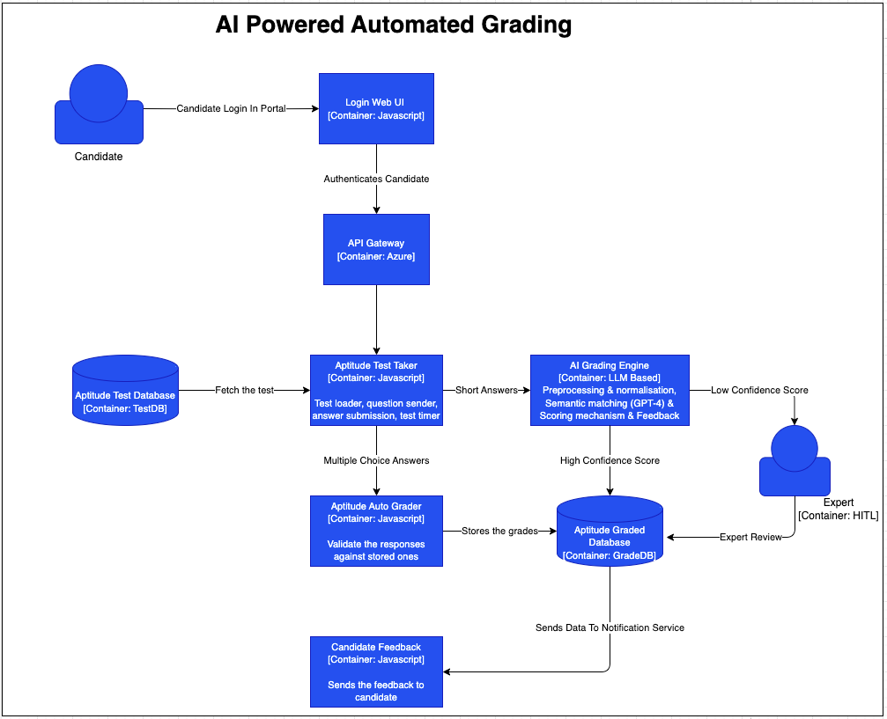

# 🏗 **Detailed Architecture for AI-Powered Automated Grading**

## 📌 **Overview**
This architecture ensures **fast, scalable, and explainable AI-driven grading** for **Test 1 (Aptitude Test)**, integrating **AI-based automation, human review workflows, and cloud scalability**.

---

## **🏗️ System Architecture Diagram**

---

## 🔹 **Key Components**

### **1️⃣ API Gateway**
- Handles grading requests from candidates.
- Routes requests to the **AI Grading Engine**.
- **Technology:** Azure API Gateway, AWS API Gateway.

### **2️⃣ AI Grading Engine**
- **Preprocessing:** Cleans, tokenizes, and standardizes responses.
- **Semantic Matching:** Uses **GPT-4 or Hugging Face Transformers (BERT, RoBERTa)** to compare responses to an ideal answer.
- **Scoring Mechanism:**
    - ✅ **Exact Match** (for straightforward answers).
    - 🔄 **Semantic Similarity** (for conceptual correctness).
    - 📊 **Weight-based Partial Credit Assignment**.
- **Technology:** OpenAI GPT-4, Hugging Face Transformers, Azure OpenAI, AWS SageMaker.

### **3️⃣ Human-in-the-Loop (HITL) Review**
- AI assigns **confidence scores** for graded responses.
- **Low-confidence responses** get flagged for **manual validation**.
- **Expert reviewers can override AI scores** via an intuitive dashboard.
- **Technology:** AWS Augmented AI (A2I), Label Studio, Custom Admin UI.

### **4️⃣ Feedback Generation & Storage**
- AI generates **personalized feedback** explaining score deductions.
- Stores all responses, scores, and feedback in **Azure SQL Database or AWS DynamoDB**.
- **Technology:** Azure SQL, AWS DynamoDB, Google Firestore.

### **5️⃣ Candidate Feedback Delivery**
- Candidates receive **real-time scores & AI-generated feedback** via web portal & email.
- **Technology:** Web portal (React.js), Notification System (SendGrid/Twilio).

---

## 📈 **Expected Benefits**
✅ **Reduces grading time by 80-90%.**
✅ **Scales efficiently for high certification demand.**
✅ **Ensures fair, explainable, and consistent grading.**
✅ **Minimizes expert workload while improving quality.**
✅ **Provides real-time feedback & transparency.**

---
