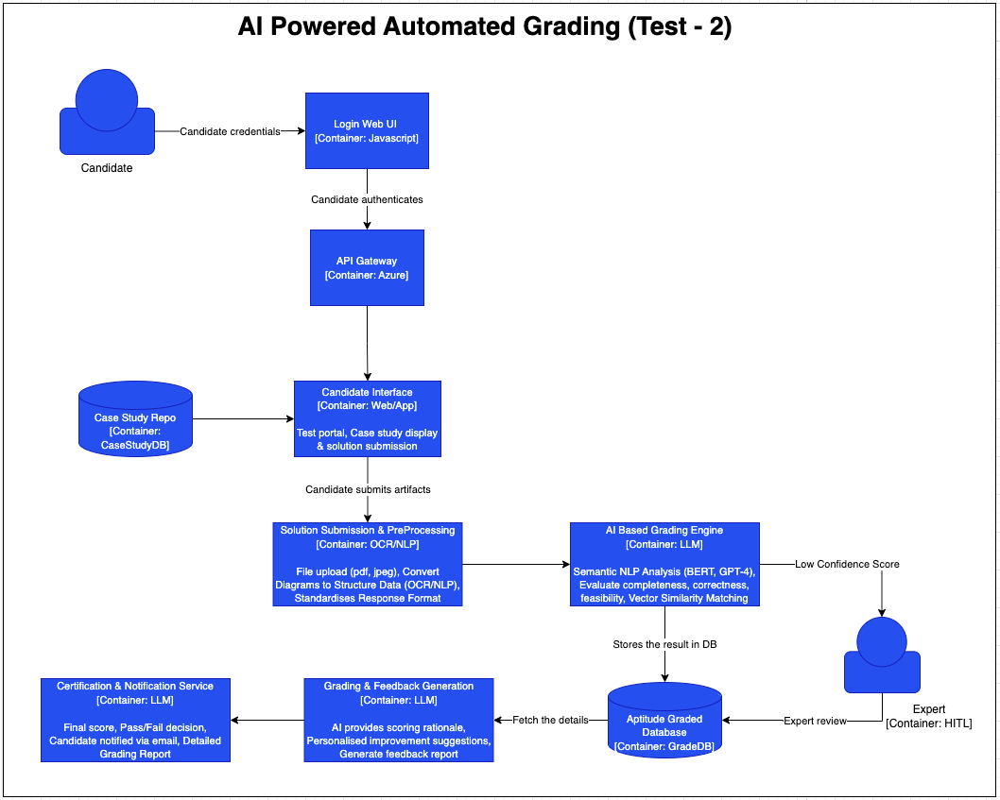

# AI-Powered Certification Test Grading System

## 🎯 Overview
This document outlines the architecture for an **AI-powered grading system** for evaluating **case study-based certification tests**. The system leverages **NLP, machine learning, cloud infrastructure, and expert validation** to ensure **efficient, scalable, and fair grading**.

---

## 📌 Architecture Diagram (Plain Text Representation)



```plaintext
                     +---------------------------------------------------+
                     |                Candidate Interface               |
                     |  - Test Portal (Web/App)                          |
                     |  - Case Study Display                             |
                     |  - Solution Submission                           |
                     +---------------------------------------------------+
                                        |
                                        v
                +--------------------------------------------------+
                |           Case Study Repository (Database)       |
                |  - Stores predefined case studies                |
                |  - Fetches case study when candidate starts test |
                +--------------------------------------------------+
                                        |
                                        v
        +------------------------------------------------------+
        |        Solution Submission & Preprocessing          |
        |  - Candidate submits architecture solution         |
        |  - File upload (Diagrams, Text, PDFs)              |
        |  - Converts diagrams to structured data (OCR/NLP)  |
        |  - Standardizes response format                    |
        +------------------------------------------------------+
                                        |
                                        v
        +------------------------------------------------------+
        |          AI-Based Grading Engine                     |
        |  - Semantic NLP Analysis (BERT, GPT-4)              |
        |  - Evaluates completeness, correctness, feasibility |
        |  - Vector similarity matching against ideal answers |
        |  - Assigns preliminary score                        |
        +------------------------------------------------------+
                                        |
                     +--------------------------+
                     |      Confidence Check     |
                     |  - If confidence score    |
                     |    is LOW -> Send to      |
                     |    Human Review           |
                     +--------------------------+
                                        |
                                        v
        +------------------------------------------------------+
        |      Human-AI Hybrid Evaluation                     |
        |  - Experts review flagged cases                    |
        |  - AI learns from expert feedback (HITL pipeline)  |
        |  - Grading consistency improvement over time       |
        +------------------------------------------------------+
                                        |
                                        v
        +------------------------------------------------------+
        |          Grading & Feedback Generation              |
        |  - AI provides scoring rationale                   |
        |  - Personalized improvement suggestions            |
        |  - Generates feedback report                       |
        +------------------------------------------------------+
                                        |
                                        v
        +------------------------------------------------------+
        |          Certification & Notification               |
        |  - Final score stored in Certification DB          |
        |  - Pass/fail decision automated                    |
        |  - Candidate notified via email                    |
        |  - Detailed grading report sent                    |
        +------------------------------------------------------+
```

---

## 🔥 Key AI & Cloud Components in the Architecture

### 1️⃣ **Natural Language Processing (NLP) & AI Model**
- **GPT-4, BERT, RoBERTa** → Understands architectural solutions
- **Vector Similarity Matching (FAISS, SentenceTransformers)** → Compares candidate solutions to ideal answers
- **Rule-Based AI & ML Scoring** → Ensures fair, explainable grading

### 2️⃣ **Cloud Infrastructure**
- **Azure Machine Learning / AWS SageMaker** → Model Hosting
- **Serverless Execution (Azure Functions / AWS Lambda)** → Scalable processing
- **Object Storage (Azure Blob, S3, Google Cloud Storage)** → Handles solution uploads (PDFs, diagrams)

### 3️⃣ **Human-in-the-Loop (HITL) Pipeline**
- **Label Studio / Amazon Augmented AI (A2I)** → Experts review AI-flagged cases
- **Feedback Loops for AI Training** → Improves grading accuracy over time

### 4️⃣ **Explainable AI (XAI) for Transparency**
- **SHAP, LIME** → Justifies AI grading decisions
- **Interactive Dashboard** → Shows breakdown of scores & feedback

---

## 🎯 Impact & Benefits
✅ **80-90% faster grading** → Reduces manual effort  
✅ **Scalable system** → Handles high submission volume  
✅ **Fair & transparent scoring** → Ensures AI decisions are explainable  
✅ **Continuous learning** → AI improves through human feedback loops  
✅ **Better candidate experience** → Provides detailed, actionable feedback

---
