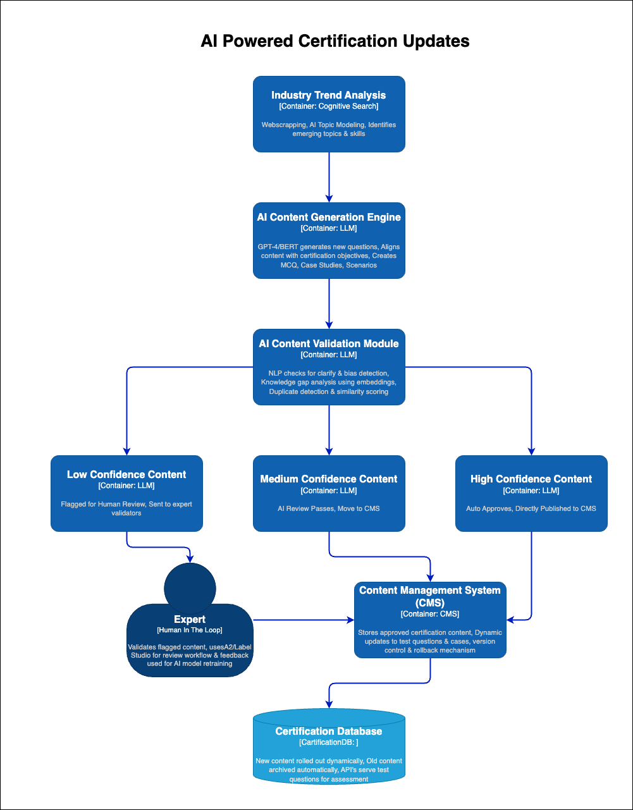

# 🚀 AI-Powered Certification Content Update - Architecture Diagram

## **🔹 Overview**
This architecture automates the certification content update process using **AI-powered trend analysis, content generation, validation, and expert review**. The system ensures that test questions and case studies remain **current, relevant, and aligned with industry changes**.

## **📌 Architecture Diagram (C2 Diagram)**

---

## **🔹 Key Components & Technologies**

| **Component** | **Technology Stack** |
|--------------|---------------------|
| **Industry Trend Analysis** | Web Scraping (BeautifulSoup, Scrapy), Azure Cognitive Search |
| **AI-Powered Content Generation** | OpenAI GPT-4, Hugging Face T5, BERT |
| **Automated Content Validation** | NLP Consistency Checks, FAISS for Similarity Search |
| **Expert Review Workflow** | Amazon Augmented AI (A2I), Label Studio |
| **CMS Integration** | React.js, FastAPI, MongoDB |
| **Content Deployment** | Azure Functions, AWS Lambda |

---

## **🎯 Expected Benefits**
✅ **🚀 80% Faster Content Updates** – AI automates tedious manual updates.  
✅ **📈 Improved Certification Relevance** – Aligns tests with industry changes.  
✅ **🔍 Quality Control with AI & Experts** – Ensures accuracy & fairness.  
✅ **⚡ Scalable System** – Supports **5-10X more certification content updates**.

---

## **🔥 Final Thoughts**
This **AI-powered content update system** ensures that **Certifiable Inc. remains a leader in certification** by dynamically **updating test questions and case studies** with **real-time industry insights**. 🚀
*Added by Data Arch Evanglist Team For Winter 2025 Kata: Architecture & AI on 17th March 2025*