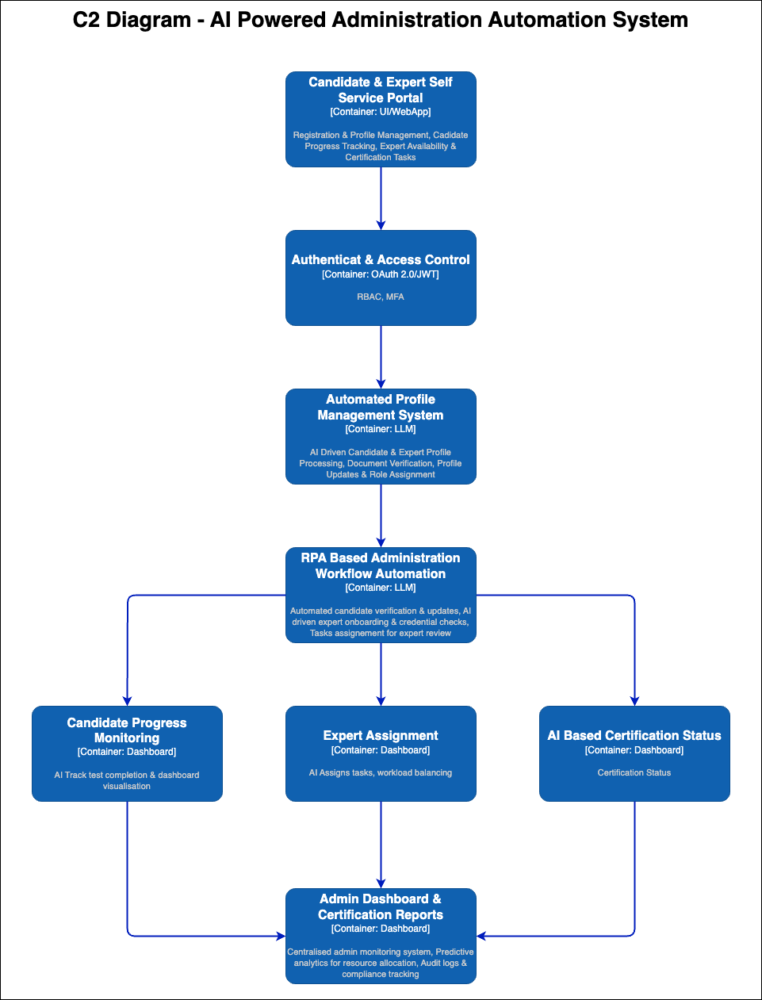

# 🚀 AI-Powered Administrative Automation System - Architecture Diagram

## **🔹 Overview**
This architecture automates **candidate & expert profile management, onboarding, and certification tracking** using AI and RPA (Robotic Process Automation). The goal is to reduce **manual administrative overhead**, **accelerate onboarding**, and **improve real-time tracking** at Certifiable Inc.

## **📌 System Architecture Diagram**

---

## **🔹 Key Components & Technologies**

| **Component** | **Technology Stack** |
|--------------|---------------------|
| **Self-Service Portal** | React.js, FastAPI, MongoDB |
| **Authentication & Security** | OAuth 2.0, JWT, MFA |
| **Automated Profile Management** | AWS Cognito, Azure AD, Firebase Auth |
| **RPA-Based Workflow Automation** | UIPath, Microsoft Power Automate |
| **AI-Powered Candidate Tracking** | Azure AI, AWS AI Services |
| **Expert Task Assignment** | AI-driven workload balancing (Python, FastAPI) |
| **Admin Dashboard & Reports** | Grafana, Kibana, Elasticsearch |

---

## **🎯 Expected Benefits**
✅ **📉 70% Reduction in Admin Overhead** – Automated workflows eliminate manual processing.  
✅ **🚀 Faster Onboarding & Profile Management** – AI-driven workflows reduce processing time.  
✅ **📊 Real-Time Monitoring & Analytics** – Improved decision-making for admin teams.  
✅ **⚡ Scalable System** – Supports **5-10X more candidates & experts without extra admin load**.

---

## **🔥 Final Thoughts**
This **AI-powered administrative automation system** streamlines candidate & expert profile management, onboarding, and progress tracking. By **leveraging AI and automation**, Certifiable Inc. can **reduce operational overhead, speed up processing, and improve overall efficiency**. 🚀
