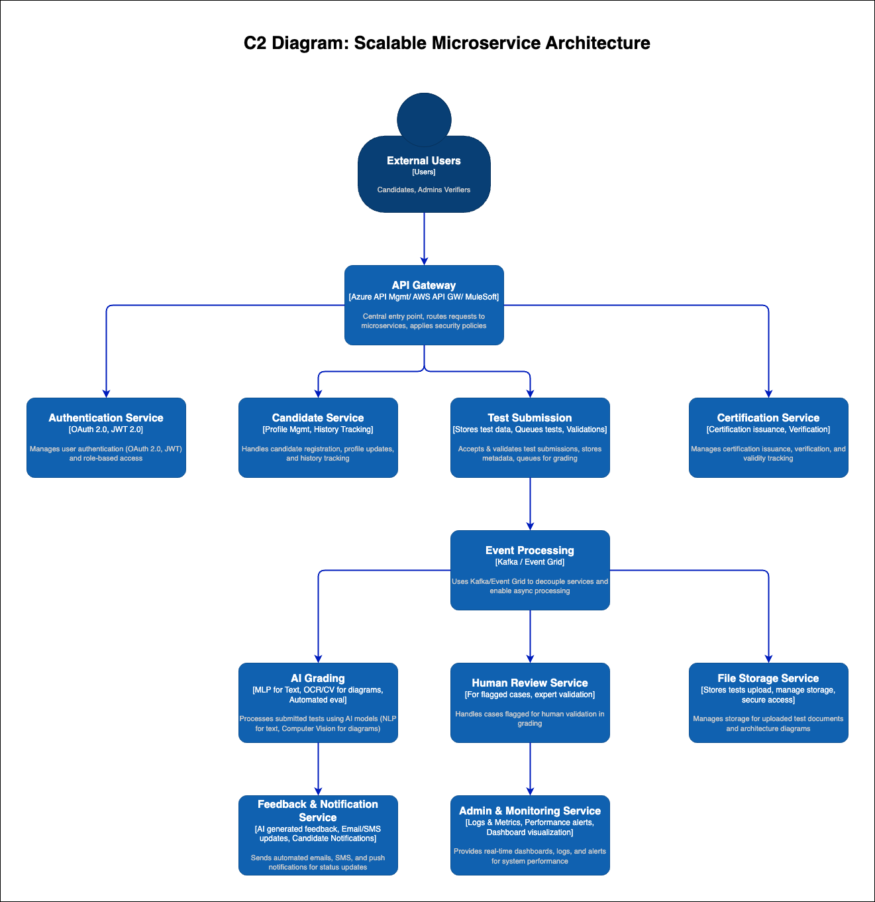

# 🚀 Scalable Microservices Architecture for Certifiable Inc.

## **🔹 Overview**
This architecture enables **scalability, high availability, and resilience** to handle **5-10X candidate growth**. It **leverages microservices, event-driven processing, and auto-scaling** to ensure seamless test submissions and grading.

## **📌 Architecture Diagram**

---

## **🔹 Key Components & Technologies**

| **Component**               | **Technology Stack** |
|-----------------------------|---------------------|
| **Candidate Interface** | React.js, Next.js, Flutter |
| **API Gateway & Load Balancer** | Azure Front Door, AWS ALB, Nginx |
| **Authentication Service** | OAuth 2.0, JWT, Azure AD, AWS Cognito |
| **Event Processing** | Kafka, Azure Event Grid, AWS SQS |
| **AI Grading Service** | OpenAI GPT-4, Hugging Face Transformers |
| **Database & Storage** | Azure CosmosDB, AWS DynamoDB, PostgreSQL |
| **CI/CD & Infrastructure** | GitHub Actions, Terraform, ArgoCD |
| **Monitoring & Logging** | Prometheus, Grafana, ELK Stack |

---

## **🎯 Expected Benefits**
✅ **🚀 10X Scalability** – Easily handles traffic spikes with microservices.  
✅ **📈 Faster Test Processing** – AI & event-driven pipelines reduce response times.  
✅ **🔄 High Availability & Load Balancing** – Prevents downtime & improves fault tolerance.  
✅ **⚡ Faster Deployments** – CI/CD automates scaling & rollouts.

---

## **🔥 Final Thoughts**
This **scalable microservices architecture** ensures **high performance, availability, and real-time test processing** while **supporting 5-10X candidate growth**. 🚀
