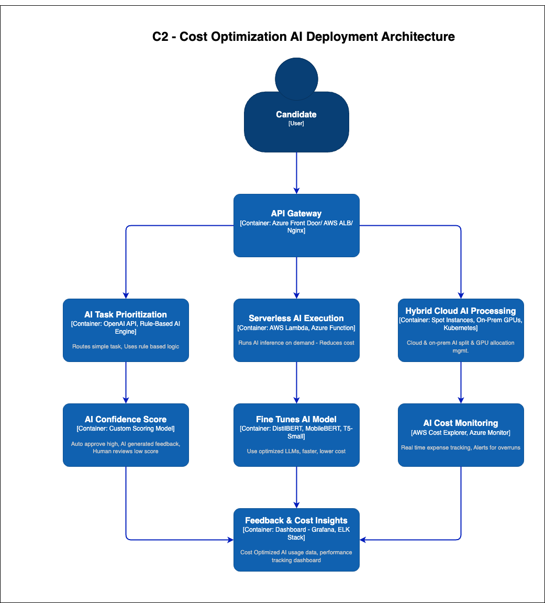

# 🚀 Cost-Optimized AI Deployment Architecture at Certifiable Inc.

## **🔹 Overview**
This architecture ensures **cost-efficient AI adoption** by integrating **serverless AI execution, hybrid cloud processing, AI task prioritization, and real-time cost monitoring**. It optimizes **compute expenses** while maintaining **automation and scalability**.

## **📌 System Architecture Diagram**

---

## **🔹 Key Components & Technologies**

| **Component** | **Technology Stack** |
|--------------|---------------------|
| **Candidate Interface** | React.js, Next.js, Flutter |
| **API Gateway & Load Balancer** | Azure Front Door, AWS ALB, Nginx |
| **AI Task Prioritization** | OpenAI API, Rule-Based AI Engine |
| **Serverless AI Execution** | AWS Lambda, Azure Functions |
| **Hybrid Cloud AI Processing** | Spot Instances, On-Prem GPUs, Kubernetes |
| **Fine-Tuned AI Models** | DistilBERT, MobileBERT, T5-Small |
| **AI Confidence Score Routing** | Custom Scoring Model |
| **AI Cost Monitoring** | AWS Cost Explorer, Azure Monitor |
| **Performance & Feedback Dashboards** | Grafana, ELK Stack |

---

## **🎯 Expected Benefits**
✅ **📉 40-60% AI Cost Reduction** – Optimized GPU usage, serverless AI, and auto-scaling reduce unnecessary compute costs.  
✅ **🚀 Scalable AI Adoption** – Allows AI deployment without exceeding budget constraints.  
✅ **⚡ Prioritized AI Processing** – Ensures complex AI tasks get necessary resources while trivial tasks are auto-routed.  
✅ **🔍 Real-Time Cost Control** – Continuous cost tracking & alerts prevent budget overruns.

---

## **🔥 Final Thoughts**
This **cost-optimized AI deployment strategy** ensures **Certifiable Inc. can scale AI automation without budget overruns**, balancing **performance, cost, and quality**. 🚀

*Added by DataArchEvanglist Team For Winter 2025 Kata: Architecture & AI on 19th Feb 2025*

*Added by Data Arch Evanglist Team For Winter 2025 Kata: Architecture & AI on 17th March 2025*