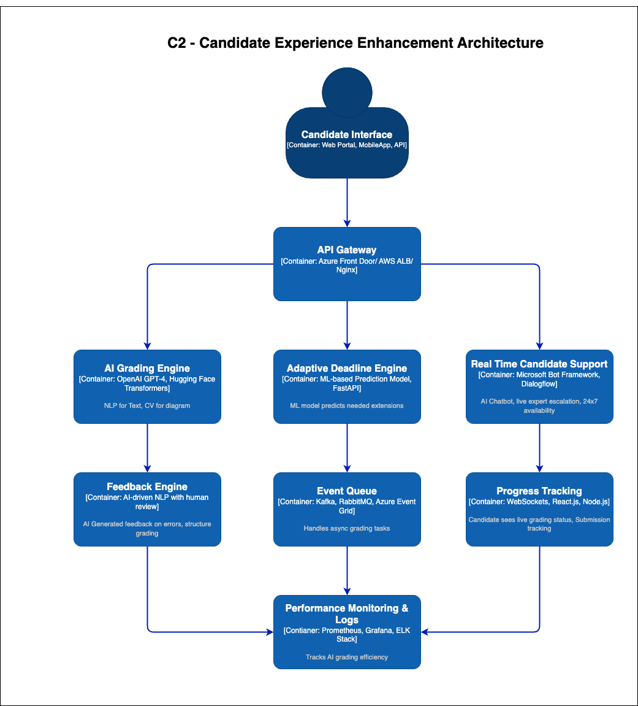

# 🚀 AI-Powered Candidate Experience Enhancement Architecture

## **🔹 Overview**
This architecture improves **candidate experience** by integrating **AI-powered grading, real-time status tracking, chatbots, and adaptive deadlines**. It enhances transparency, reduces delays, and provides 24/7 candidate support.

## **📌 System Architecture Diagram**

---

## **🔹 Key Components & Technologies**

| **Component** | **Technology Stack** |
|--------------|---------------------|
| **Candidate Interface** | React.js, Next.js, Flutter |
| **API Gateway & Load Balancer** | Azure Front Door, AWS ALB, Nginx |
| **AI Grading Engine** | OpenAI GPT-4, Hugging Face Transformers |
| **Computer Vision for Architecture Analysis** | YOLO, Detectron2 |
| **Adaptive Deadline Engine** | ML-based Prediction Model, FastAPI |
| **Real-Time Candidate Support** | Microsoft Bot Framework, Dialogflow |
| **Feedback Engine** | AI-driven NLP with human review |
| **Event Queue Processing** | Kafka, RabbitMQ, Azure Event Grid |
| **Progress Tracking Dashboard** | WebSockets, React.js, Node.js |
| **Monitoring & Analytics** | Prometheus, Grafana, ELK Stack |

---

## **🎯 Expected Benefits**
✅ **🚀 50-70% Faster Grading Turnaround** – AI accelerates evaluation & reduces workload.  
✅ **📈 Higher Candidate Retention** – Transparency & AI-driven support improve engagement.  
✅ **⚡ Fewer Support Requests** – AI chatbot handles routine candidate inquiries.  
✅ **🔍 Reduced Manual Workload** – AI grading & feedback automation free up expert reviewers.

---

## **🔥 Final Thoughts**
This **AI-powered candidate experience enhancement** ensures **faster grading, real-time support, and deadline flexibility**, helping **retain candidates and protect Certifiable Inc.'s reputation**. 🚀
