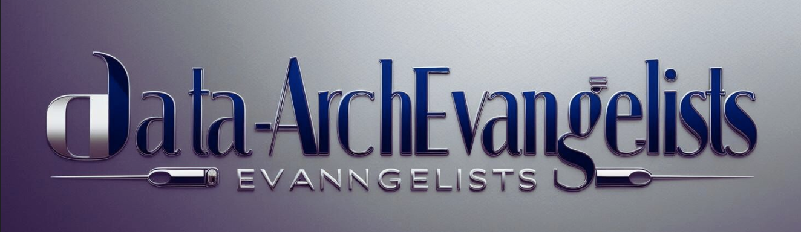
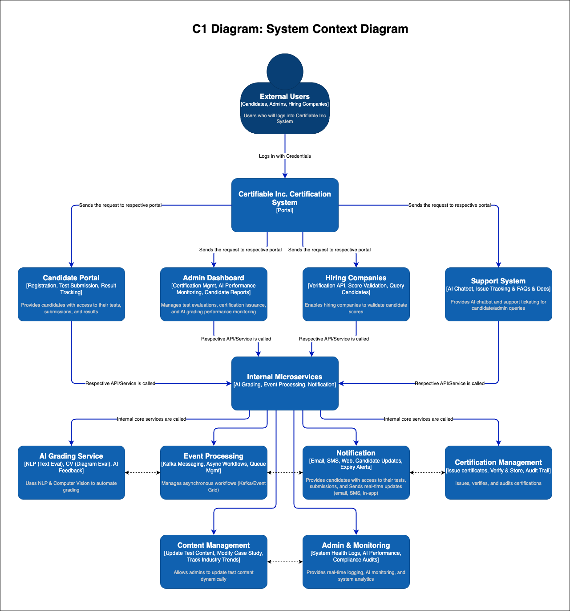
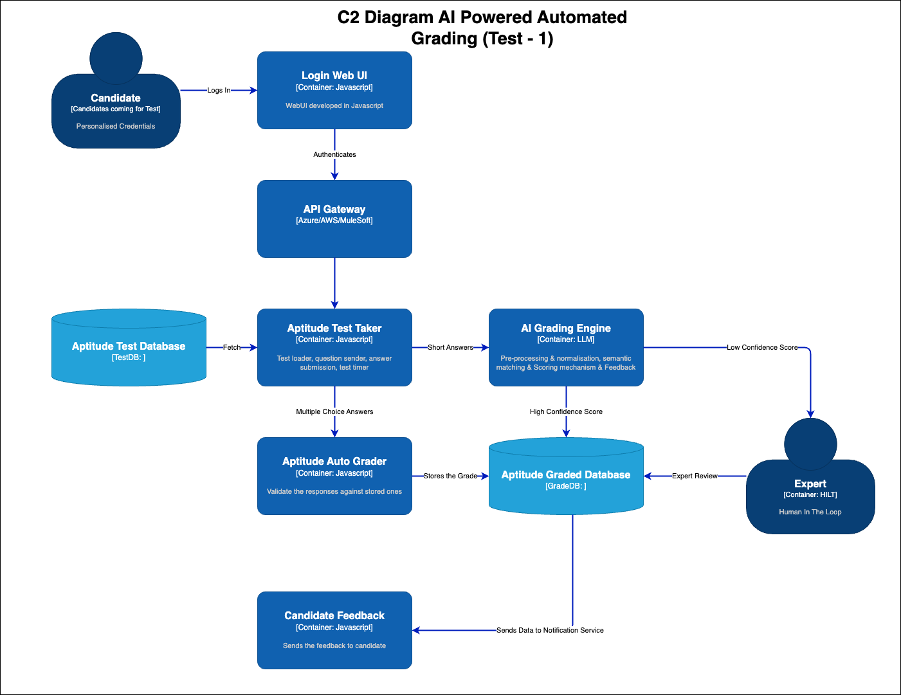
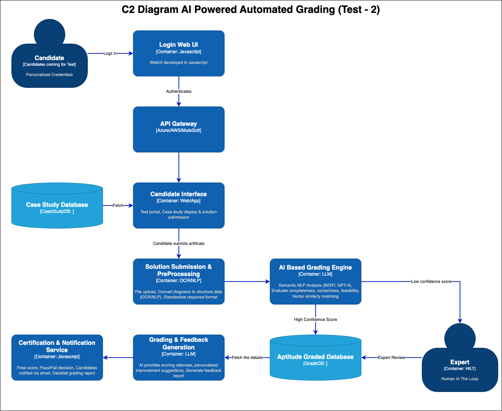
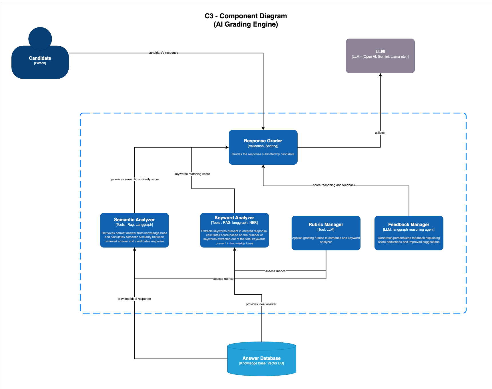

### Welcome to the **Certifiable Inc. Certification System** repository!

This project is designed to provide AI-Powered Certification System which automates time-intensive grading of exams, managing accuracy and feedback, and maintaining the integrity of tests and case studies, handling customer inquiries on products, orders, returns and refunds while seamlessly integrating with our company’s database. 
This AI-driven solution is designed to streamline grading process through advanced generative AI, maintaining the credibility, accuracy, and scalability of certification process at best.

---

## **🔹 Overview**
Certifiable Inc. is transforming its **software architecture certification process** with AI-driven automation, cloud scalability, and real-time candidate support. This project was designed to tackle **scalability, candidate experience, administrative inefficiencies, and cost concerns**, ensuring **faster, fairer, and more efficient certifications**.

---

## 📌 **Table of Contents**
1. [Problem Statement](#-problem-statement)
2. [Team Members](#-team-members)
2. [Proposed Solution](#-proposed-solution)
3. [Challenges & Impact](#-challenges--impact)
3. [System Architecture](#-system-architecture)
5. [Technical Implementation](#-technical-implementation)
6. [Architecture Decision Records (ADRs)](#-architecture-decision-records-adrs)
7. [How to Contribute](#-how-to-contribute)

---

## 🎯 **Problem Statement**

Certifiable Inc. faced several challenges in scaling its certification process:
- **Manual grading inefficiencies** slowed test evaluations.
- **Candidate experience issues** due to strict deadlines & delays.
- **Scalability risks** as demand grew by 5-10X.
- **High AI adoption costs**, making automation challenging.
- **Administrative inefficiencies**, increasing operational overhead.

📄 [Detailed Problem Statement](01_problem_statement/01_problem_statement.md)

---

### 🌟 **Team Members**

Hi! We are the **"Data-ArchEvangelists Team"** – playing with Data via AI.
- 

-  **[Nitesh Sharma](https://www.linkedin.com/in/nsharma02/)** -           Data Architect
-  **[Mohit Tiwari](https://www.linkedin.com/in/mohit-tewari/)** -         Lead Data Scientist
-  **[Jyoti Singh](https://www.linkedin.com/in/jyoti-singh-49b2b319/)** -  Lead Data Engineer

---

## 🚀 **Proposed Solution**

To address these challenges, we implemented:
- **AI-Powered Grading Services:** Automating 80% of evaluations using NLP & Computer Vision.
   
   - a) [Test 1 ](03_solution/01_manual_grading_test_1.md)(Aptitude Test - Short Answer): 3 hours per candidate.
   - b) [Test 2](03_solution/01_manual_grading_test_2.md) (Architecture Submission): 8 hours per candidate.
   - c) [Feedback Generation](03_solution/03_feedback_generation_process.md) (Feedback Generation)AI enabled solution to provide feedback to tests.

- **Real-Time Candidate Support:** AI chatbots & tracking dashboards.

   - [Candidate Experience](03_solution/08_candidate_experience_solution.md)
- **Certification & Content Management:** Efficient way to manage candidate as well as interviewer profile.

  - [Content Management](03_solution/04_updating_certification_content.md)
- **Event-Driven Microservices:** Scalable cloud-based architecture.

   - [Event Driven Processing](03_solution/06_system_scalability_risks.md)

- **Notification** Email, SMS, Candidate updates and expiry alert.

   - [Administration & Monitoring](03_solution/05_adminstration_inefficiencies.md)

---
## 🚀 **Challenges & Impact**

| 🚧 **Challenge**                          | 🎯 **Impact** |
|------------------------------------------|----------------------------------------------------------------|
| **Manual Grading of Certification Tests** | 🔴 Delays grading turnaround, hard to scale without automation. |
| **Feedback Generation Bottleneck**       | 🟠 Inconsistent feedback, longer cycles reduce candidate throughput. |
| **Outdated Certification Content**       | 🔴 Difficult to update with industry trends, risking credibility. |
| **Inefficient Administrative Processes** | 🟡 High overhead for managing candidate & expert data. |
| **System Scalability Issues**            | 🔴 Risk of system crashes, degraded performance, and slow response. |
| **High Cost of AI Integration**          | 🟠 Budget constraints could limit automation potential. |
| **Poor Candidate Experience**            | 🔴 Slow response times and outdated processes hurt reputation. |

[more information](02_challenges/01_challenges_and_impact.md)

## 🏗 **System Architecture**
Our system leverages **microservices, AI-driven automation, and cloud-native deployment** to deliver a scalable and cost-effective solution.

### C1 System Context Diagram

- **Modular Microservices:** Independent grading, feedback, admin, and candidate services.
- **Event-Driven Processing:** Kafka, Redis Streams, and WebSockets for fast communication.
- **Cloud-Native & Serverless AI Execution:** AWS Lambda, Azure Functions.
- **Scalability with Kubernetes (AKS/EKS)** and auto-scaling policies.

**Architecture & Design**
1. **[001: AI-Powered Certification Evaluation System - Test1](04_architecture_and_design/01_ai_powered_certification_testing_1_architecture.md)**
2. **[002: AI-Powered Certification Evaluation System - Test2](04_architecture_and_design/02_ai_powered_certification_testing_2_architecture.md)**
3. **[003: AI-Driven Feedback Generation](04_architecture_and_design/03_ai_powered_certification_evaulation_system.md)**
4. **[004: AI-Powered Content Generation](04_architecture_and_design/04_ai_powered_certification_content_update.md)**
5. **[005: AI-Powered Administrative Automation](04_architecture_and_design/05_ai_powered_adminstration_automation_system.md)**
6. **[006: Scalable Microservices Architecture](04_architecture_and_design/06_scalable_microservice_architecture.md)**
7. **[007: Cost-Optimized AI Deployment](04_architecture_and_design/07_cost_optimized_ai_deployment_architecture.md)**
8. **[008: AI-Powered Candidate Experience](04_architecture_and_design/08_ai_powered_candidate_experience_enhancement_architecture.md)**
---
---

## 🛠 **Technical Implementation**
| **Component**               | **Technology Stack** |
|-----------------------------|---------------------|
| **Frontend** | React.js, Next.js, Flutter |
| **Backend API** | FastAPI, Node.js |
| **AI Grading & Feedback** | OpenAI GPT-4, Hugging Face Transformers |
| **Image & Diagram Processing** | YOLO, Detectron2 |
| **Cloud Infrastructure** | Kubernetes (AKS/EKS), AWS Lambda, Azure Functions |
| **Messaging & Event Processing** | Kafka, Redis Streams, RabbitMQ |
| **Database & Storage** | PostgreSQL, Azure CosmosDB, AWS DynamoDB |
| **Monitoring & Logging** | Prometheus, Grafana, ELK Stack |

[📄 Full Technical Breakdown](06_implementation/06_implemenentation_phases.md)

---

## 📜 **Architecture Decision Records (ADRs)**
We documented key architectural decisions to ensure transparency and adaptability.

1. **[ADR-001: AI-Powered Certification Evaluation System - Test1](05_adrs/01_architecture_decision_records.md)**
2. **[ADR-002: AI-Powered Certification Evaluation System - Test2](05_adrs/02_architecture_decision_records.md)**
3. **[ADR-003: AI-Driven Feedback Generation](05_adrs/03_adr_feedback_generation.md)**
4. **[ADR-004: AI-Powered Content Generation](05_adrs/04_adr_updating_certification_content.md)**
5. **[ADR-005: AI-Powered Administrative Automation](05_adrs/05_adr_adminstration_inefficiencies.md)**
6. **[ADR-006: Scalable Microservices Architecture](05_adrs/06_adr_scalable_microservices_architecture.md)**
7. **[ADR-007: Cost-Optimized AI Deployment](05_adrs/07_adr_cost_optimized_ai_deployment.md)**
8. **[ADR-008: AI-Powered Candidate Experience](05_adrs/08_adr_ai_powered_candidate_experience.md)**
---

## 🤝 **How to Contribute**
We welcome contributions! Follow these steps to contribute:
1. **Fork the Repository**
2. **Clone the Repo:** `git clone https://github.com/your-repo/certifiable-ai.git`
3. **Create a Branch:** `git checkout -b feature-branch`
4. **Commit Your Changes:** `git commit -m 'Added new feature'`
5. **Push & Submit a PR:** `git push origin feature-branch`

---

📧 **For inquiries, reach out at:** [certifiable-support@example.com](mailto:certifiable-support@example.com)

🚀 **Let’s redefine certification with AI!**
